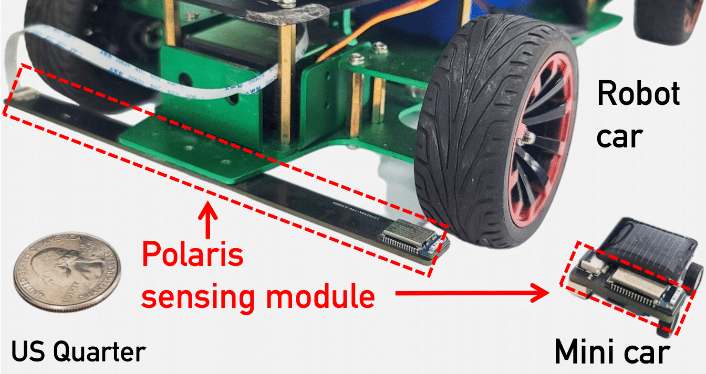

# Hardware Design of Polaris' Sensor Array

## Description
This directory contains the comprehensive PCB design source codes for Polaris' sensor array, including the sensor bar for fiducial detection and a flashing board for programming the MCU (MDBT42Q-512KV2). 
- The `/SensorArray_RobotCar` directory contains the PCB design for the sensor array used in the robot car.

- The `/SensorArray_MiniCar` directory contains the PCB design for the sensor array used in the mini car.

- The `/Flashing_Module` directory contains the flashing board used to program the MCU for obtaining magnetometer readings.

## Hardware requirements
The hardware setup requires various components during the design and fabrication process. 
Below is a list of the components used in designing and manufacturing our prototype.

### Sensor array
| Component  | Description | Package | Quantity |
| ------------- | ------------- | ------------- | ------------- |
|[Raytac MDBT42Q-512KV2](https://www.digikey.com/en/products/detail/raytac/MDBT42Q-512KV2/13677592) | Microcontroller Unit | 41-SMD | 1 |
|[Melexis MLX90393](https://www.digikey.com/en/products/detail/melexis-technologies-nv/MLX90393SLW-ABA-011-RE/5031684) | Magnetometer |16-QFN | M |
|[HCI FC31M2-32.768-NTLNNDTL](https://www.lcsc.com/product-detail/Crystals_HCI-FC31M2-32-768-NTLNNDTL_C5120559.html)  | 32.768kHz Surface Mount Crystal | SMD3215-2P | 1 |
| [Diodes Incorporated AP2112K-3.3TRG1](https://www.lcsc.com/product-detail/Voltage-Regulators-Linear-Low-Drop-Out-LDO-Regulators_Diodes-Incorporated-AP2112K-3-3TRG1_C51118.html)  | Voltage Regulator | SOT-25-5 | 1 |
|[C&K KMR221GLFS](https://www.lcsc.com/product-detail/Tactile-Switches_C-K-KMR221GLFS_C72443.html) | Tactile Switch | SMD | 1 |
| [Vishay Intertech SI2301CDS-T1-GE3](https://www.lcsc.com/product-detail/MOSFETs_Vishay-Intertech-SI2301CDS-T1-GE3_C10487.html) |  P-Channel MOSFET | SOT-23 | 1 |
| [Taiwan Semiconductor 1N4148WS RRG](https://www.lcsc.com/product-detail/Switching-Diodes_Taiwan-Semiconductor-1N4148WS-RRG_C485027.html) | Switching Diodes | SOD-323F | 1 |
| [LRC LMBR120FT1G](https://www.lcsc.com/product-detail/Schottky-Diodes_LRC-LMBR120FT1G_C81143.html) | Schottky Diodes | SOD-123FL | 1 |
| [Resistor](https://www.digikey.com/en/products/filter/chip-resistor-surface-mount/52?s=N4IgTCBcDaIE4FMDOBLJAXA9nABABgBY8IBdAXyA) | Chip Resistors | 0402 | 1kΩ (2), 10kΩ (1), 100kΩ (2) |
| [Capacitor](https://www.digikey.com/en/products/filter/ceramic-capacitors/60?s=N4IgTCBcDaIMYEMAOC4EsAuB7ATgAgAYAWAiAXQF8g) | Ceramic Capacitors | 0402| 10uF (3), 1uF (1), 12pF (2), 0.1uF (M) |
| [Inductor](https://www.digikey.com/en/products/filter/fixed-inductors/71?s=N4IgTCBcDaIGYEsAeBTAJgAgQOzQVwGMAXAewCcBnDABgBZqIBdAXyA) | Inductors | 0402| 10uH (1), 15nH (1) |
| [Vishay Intertech TLMS1000-GS08](https://www.lcsc.com/product-detail/LED-Indication-Discrete_Vishay-Intertech-TLMS1000-GS08_C241893.html) | LED Indication, Red | 0603 | 1 |
| [Foshan NationStar Optoelectronics NCD0603B1](https://www.lcsc.com/product-detail/LED-Indication-Discrete_Foshan-NationStar-Optoelectronics-NCD0603B1_C84266.html)| LED Indication, Blue  | 0603 | 1 |
| [JUSHUO AFC01-S08FCA-00](https://www.lcsc.com/product-detail/FFC-FPC-Flat-Flexible-Connector-Assemblies_JUSHUO-AFC01-S08FCA-00_C262657.html) |FPC/FFC Connector | SMD, P=0.5mm | 1 |
| [HDGC HDGC1251WR-2P](https://www.lcsc.com/product-detail/Wire-To-Board-Connector_HDGC-HDGC1251WR-2P_C5175203.html) | Wire To Board Connector | Plugin, P=1.25mm | 1 |

### Flashing board
| Component  | Description | Package | Quantity |
| ------------- | ------------- | ------------- | ------------- |
| [Diodes Incorporated AP2112K-3.3TRG1](https://www.lcsc.com/product-detail/Voltage-Regulators-Linear-Low-Drop-Out-LDO-Regulators_Diodes-Incorporated-AP2112K-3-3TRG1_C51118.html)  | Voltage Regulator | SOT-25-5 | 1 |
| [Vishay Intertech SI2301CDS-T1-GE3](https://www.lcsc.com/product-detail/MOSFETs_Vishay-Intertech-SI2301CDS-T1-GE3_C10487.html) |  P-Channel MOSFET | SOT-23 | 1 |
| [LRC LMBR120FT1G](https://www.lcsc.com/product-detail/Schottky-Diodes_LRC-LMBR120FT1G_C81143.html) | Schottky Diodes | SOD-123FL | 1 |
| [Microchip Tech MCP73831T-2ATI/OT](https://www.lcsc.com/product-detail/Battery-Management_Microchip-Tech-MCP73831T-2ATI-OT_C14879.html) | Battery Management | SOT-23-5 | 1 |
| [SKYWORKS/SILICON LABS CP2104-F03-GM](https://www.lcsc.com/product-detail/USB-Converters_SKYWORKS-SILICON-LABS-CP2104-F03-GM_C430013.html) | USB Converter | QFN-24-EP(4x4)| 1 |
| [TFM-105-12-S-D-A](https://www.digikey.com/en/products/detail/samtec-inc/TFM-105-12-S-D-A/6678838) | Connector Header | SMD 10POS 1.27MM | 1 |
| [Resistor](https://www.digikey.cn/en/products/filter/chip-resistor-surface-mount/52?s=N4IgTCBcDaIE4FMDOBLJAXA9nABABgDY8BmEAXQF8g) | Chip Resistors | 0603 | 1kΩ (3), 100kΩ (3) |
| [Capacitor 0.1uF](https://www.digikey.cn/en/products/filter/ceramic-capacitors/60?s=N4IgTCBcDaIMYEMAOC4EsAuB7ATgAgAYA2AgZkIDoBGEAXQF8g) | Ceramic Capacitors | 0603 |  2 |
| [Capacitor 10uF](https://www.digikey.cn/en/products/filter/ceramic-capacitors/60?s=N4IgjCBcoEwAwBYCcVQGMoDMCGAbAzgKYA0IA9lANrhwAEArQGIgC6pADgC5QgCqAdgEtOAeUwBZQtnwBXAE6EQAXyWkYVEGmztsaYWTm04ADjgBWWmDislQA) | Ceramic Capacitors | 0805 | 5 |
| [PARALIGHT L-C191KRCT](https://www.lcsc.com/product-detail/span-style-background-color-ff0-LED-span-span-style-background-color-ff0-Indication-span-Discrete_PARALIGHT-L-C191KRCT_C2917807.html) | LED Indication, Orange | 0603 | 1 |
| [SHOU HAN MicroXNJ](https://www.lcsc.com/product-detail/USB-Connectors_SHOU-HAN-MicroXNJ_C404969.html) | Micro-B USB Connectors | SMD | 1 |
| [JUSHUO AFC01-S08FCA-00](https://www.lcsc.com/product-detail/FFC-FPC-Flat-Flexible-Connector-Assemblies_JUSHUO-AFC01-S08FCA-00_C262657.html) |FPC/FFC Connector | SMD, P=0.5mm | 1 |
| [HDGC HDGC1251WR-2P](https://www.lcsc.com/product-detail/Wire-To-Board-Connector_HDGC-HDGC1251WR-2P_C5175203.html) | Wire To Board Connector | Plugin, P=1.25mm | 1 |

## PCB design tool and library
We utilize [EasyEDA](https://easyeda.com/) to design PCB boards.
The component library of capacitive and resistance relies on the standard library.
The footprints for these components can be found in the [EasyEDA 3D model library](https://docs.easyeda.com/en/PCB/3D-Model-Manager/index.html).
The footprint of the MLX90393 magnetometer we used, can see [here](https://www.snapeda.com/parts/MLX90393SLW-ABA-011-RE/Melexis%20Technologies/view-part/551380/?ref=search&t=MLX90393).

After the PCB is manufactured, we also provide an interactive HTML BOM file to facilitate the quick installation of components. 
Please refer to the `BOM.html` file.