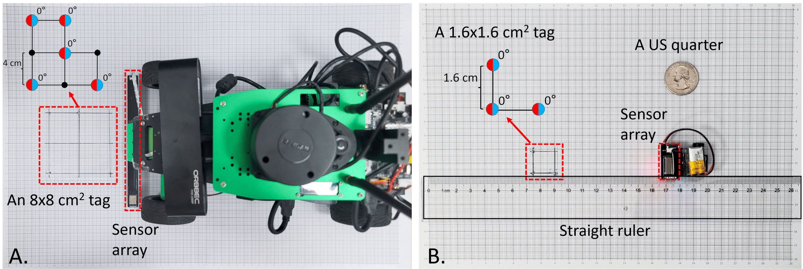

# PCB Design of Polaris' Sensor Array

## Description
This directory contains all the PCB design for Polaris' sensor array, including
two sensor array prototypes for two robotic systems: a robot car
and a miniature car. 
The robot car’s sensor array measures 16.9𝑐𝑚 &times; 1.2𝑐𝑚 and comprises 9 magnetometers spaced 2cm apart. 
For the miniature platform, we built a compact sensor array consisting of three magnetometers with an inter-sensor distance of only 0.8 cm. Its dimension is 2.5𝑐𝑚 &times; 1.2𝑐𝑚.

The design files of compact sensor array for the miniature platform is in `./PCB_MiniCar`, including a "PCBDoc" file, a "SchDoc" file and a BOM file.
The design files of the sensor array for the robot car is in `./PCB_RobotCar`, including a "PCBDoc" file, a "SchDoc" file and a BOM file.

The "PCB_USB_Module" directory contains the PCB board design for connectivity and programming.

## Design Tool and Library
We utilize [Altium Designer](https://www.altium.com/altium-designer) (version 20.0.13) to design these PCB boards.
The component library of capacitive and resistance relies on the standard library.
The footprint of the MLX90393 magnetometer we used, can see https://www.snapeda.com/parts/MLX90393SLW-ABA-011-RE/Melexis%20Technologies/view-part/551380/?ref=search&t=MLX90393

