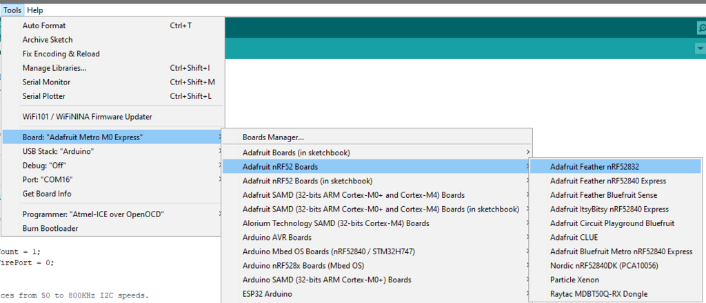
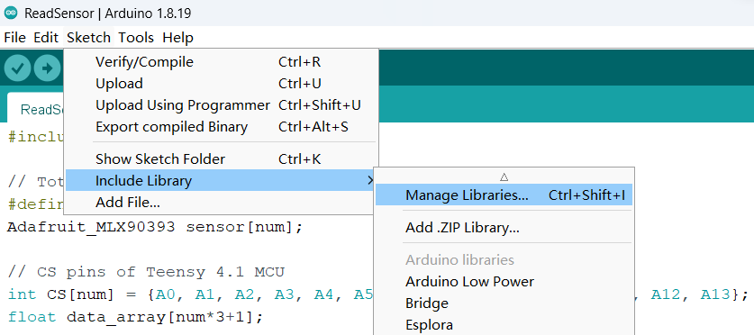
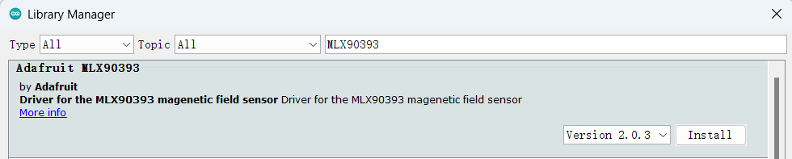

# About
This directory contains all code implementation and hardware designs for Polaris.

As a brief summary, fiducial marking is indispensable in mobile robots, including their pose calibration, contextual perception, and navigation. However, existing fiducial markers rely solely on vision-based perception which suffers such limitations as occlusion, energy overhead, and privacy leakage. 

We present Polaris, the first vision-free fiducial marking system, based on a novel, full-stack magnetic sensing design. 
Polaris can achieve reliable and accurate pose estimation and contextual perception, even in NLOS scenarios. 
Its core design includes: (1) a novel digital modulation scheme, Magnetic Orientation-shift Keying (MOSK) that can encode key information like waypoints and coordinates with passive magnets; (2) a robust and lightweight magnetic sensing framework to decode and localize the magnetic tags. 
Our design also equips Polaris with three key features: sufficient encoding capacity, robust detection accuracy, and low energy consumption. 
We have built an end-to-end system of Polaris and tested it extensively in real-world scenarios. The testing results have shown Polaris to achieve an accuracy of up to 0.58 mm and 1&deg; in posture estimation with a power consumption of only 25.08 mW.

# Lisense
Polaris is licensed under the MIT license included in the [LICENSE](./LICENSE) file.

# Setup
To use Polaris, the following hardwares and development tools are required:
* [Sensor array](#polaris-sensor-array)
* [Arduino IDE](#arduino-ide-setup)
* [Python environment](#python-environment-setup)
* [PCAN-View](#connect-to-the-can-network)

## Polaris sensor array
We provide the manufacturing details of the Polaris' sensor array in `/PCBs`, please see the related [README](./PCBs/README.md) file.

## Arduino IDE setup
Arduino IDE is used for programing the sensor array.

1. Download and install [Arduino IDE](https://www.arduino.cc/en/software)
2. Set up the Arduino IDE for the nRF52 Development Board, according to the [official instruction](https://learn.adafruit.com/bluefruit-nrf52-feather-learning-guide/arduino-bsp-setup).
Once completed, you will be able to access the board information by clicking on the 'Tools' menu
  

3. Install the Adafruit MLX90393 Library for the Arduino IDE:
    - Click 'Sketch' --> 'Include Library' --> 'Manage Libraries...'
    
    - Search for Adafruit MLX90393, and install the Adafruit MLX90393 library:
    

## Python environment setup
The  Polaris' sensing pipeline is developed using both the Python and C programming language.

1. Install the Python environment. You can install the [official Python distribution](https://www.python.org/downloads/) or [Anaconda](https://www.anaconda.com/download)
2. Install all the dependencies listed in the `./Code/requirements.txt` file by using the command 'pip install \<package-name\>'.

# Run a Quick Demo
You can find a quick demo in the `/Quick_Demo` directory. For more information, please refer to the related [README](./Quick_Demo/README.md) file.

# Citing Polaris
If you use Polaris in your research or wish to refer to the baseline results, please use the provided BibTeX entry below.