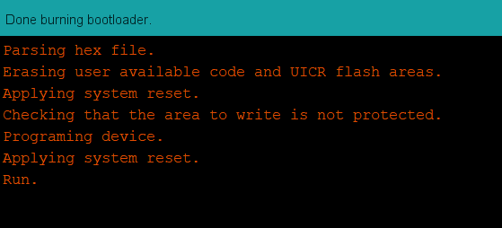

# About
This directory contains all code implementation and hardware designs for Polaris.

# Overview
We present Polaris, the first vision-free fiducial marking system, based on a novel, full-stack magnetic sensing design. 
Polaris can achieve reliable and accurate pose estimation and contextual perception, even in NLOS scenarios. 

Its core design includes: (1) a novel digital modulation scheme, Magnetic Orientation-shift Keying (MOSK) that can encode key information like waypoints and coordinates with passive magnets; (2) a robust and lightweight magnetic sensing framework to decode and localize the magnetic tags. 
Our design also equips Polaris with three key features: sufficient encoding capacity, robust detection accuracy, and low energy consumption. 
We have built an end-to-end system of Polaris and tested it extensively in real-world scenarios. The testing results have shown Polaris to achieve an accuracy of up to 0.58 mm and 1° in posture estimation with a power consumption of only 25.08 mW.

# Setup
To use Polaris, the following steps are required:
* [Building the hardware](#building-the-hardware)
* [Programing the sensor array](#programing-the-sensor-array)
* [Tag fabrication](#tag-fabrication)
* [Running the sensing pipeline](#running-the-sensing-pipeline)

## Building the hardware
We provide the hardware requirements and manufacturing details of Polaris' sensing array in `/PCBs`, please see the related [README](./PCBs/README.md) file.

## Programing the sensor array
We use the Arduino IDE to program the sensor array according to the hardware specifications.
### Arduino IDE setup
1. Download and install the [Arduino IDE](https://www.arduino.cc/en/software). For our prototype, we are using Version 1.8.19.
2. Configure the Arduino IDE for the nRF52 Development Board by following the [official instruction](https://learn.adafruit.com/bluefruit-nrf52-feather-learning-guide/arduino-bsp-setup).
After setup, you can access the board information by clicking on the 'Tools' menu.
  
3. Install the Adafruit MLX90393 Library for the Arduino IDE:
    - Click 'Sketch' --> 'Include Library' --> 'Manage Libraries...'
    
    - Search for Adafruit MLX90393, and install the Adafruit MLX90393 library:
    

### Programing setup
To program the sensor array using the hardware and Arduino IDE, follow these steps:
1. The microcontroller unit (MCU) in use is the MDBT42Q-512KV2 module, which features a Nordic nRF52832 chip. Since the module is equipped with a blank chip, it needs to be programmed using a J-Link programmer during the initial setup. Please note that this programming step is only required once for a new sensor array.
    - In our prototype, we use a [J-Link EDU Mini](https://www.segger.com/products/debug-probes/j-link/models/j-link-edu-mini/) for programming, one can follow the following hardware setup:
    
    - Open the Arduino IDE --> Click 'Tools' --> Click 'Programmer' --> Choose 'J-Link for Bluefruit nRF52'
    
    - Click 'Tools' --> Click 'Burn Bootloader'. When you see the following messages, it indicates that the MCU has been programmed successfully.
    

2. After programming the MCU, you can disconnect the J-Link module and use the Arduino IDE to upload the code that activates the magnetometer readings.
    - Setup the flashing module and the target sensor array and connect to your PC.Make sure the 'Board,' 'Port,' and 'Programmer' settings in the Arduino IDE's 'Tools' menu are properly configured
    
    - Select the sensing code from the '/Arduino' directory. Both BLE and wired data transmission codes are available for various tasks. Please refer to the relevant file
    - Upload the corresponding Arduino code to the sensor array using the Arduino IDE
    

3. After successfully programming the Arduino code to the sensor array, you can use the Python code in the '/Read_Raw_Sensor' directory to read the raw sensor data.

## Tag fabrication
In our protetype, we use an ultra-thin and durable PVC plane with 
a thickness of 0.2 mm as the substrate and Neodymium (NdFeB) magnets.
To fabricate the tag, we propose a four-step process. 
For more details, please see Sec.7.2 in the paper.

## Running the sensing pipeline
Once the sensor array is programmed, you can run the Polaris' sensing pipeline. You can find the sensing code in the `/Sensing_Pipeline` directory, please see the related [README](./Sensing_Pipeline/README.md) file.

# Getting started with Polaris
To help users quickly get started with our Polaris system, we’ve provided an offline version of the sensing algorithm framework. 
The relevant data and source code can be found in the the `/Evaluation` directory. 
For more information, please refer to the related [README](./Evaluation/README.md) file.