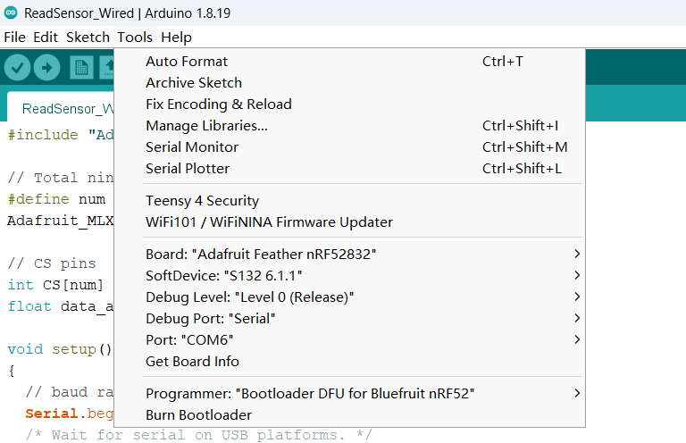

# The source code of the artifact submission for Polaris in MobiCom'24

This repository contains the artifacts and guidelines for ACM Badging in the MobiCom 2024 proceedings.

# Overview
We present Polaris, the first vision-free fiducial marking system, based on a novel, full-stack magnetic sensing design. 
Polaris can achieve reliable and accurate pose estimation and contextual perception, even in NLOS scenarios. 

Its core design includes: (1) a novel digital modulation scheme, Magnetic Orientation-shift Keying (MOSK) that can encode key information like waypoints and coordinates with passive magnets; (2) a robust and lightweight magnetic sensing framework to decode and localize the magnetic tags. 
Our design also equips Polaris with three key features: sufficient encoding capacity, robust detection accuracy, and low energy consumption. 
We have built an end-to-end system of Polaris and tested it extensively in real-world scenarios. The testing results have shown Polaris to achieve an accuracy of up to 0.58 mm and 1&deg; in posture estimation with a power consumption of only 25.08 mW.

# Setup
To use Polaris, the following steps are required:
* [Building the hardware](#building-the-hardware)
* [Programing the sensor array](#programing-the-sensor-array)
* [Running the sensing pipeline](#running-the-sensing-pipeline)

## Building the hardware
We provide the hardware requirements and manufacturing details of Polaris' sensing array in `/PCBs`, please see the related [README](./PCBs/README.md) file.

## Programing the sensor array
Based on the hardware, we use Arduino IDE to program the sensor array.
### Arduino IDE setup
1. Download and install [Arduino IDE](https://www.arduino.cc/en/software)
2. Set up the Arduino IDE for the nRF52 Development Board, according to the [official instruction](https://learn.adafruit.com/bluefruit-nrf52-feather-learning-guide/arduino-bsp-setup).
Once completed, you will be able to access the board information by clicking on the 'Tools' menu
  
3. Install the Adafruit MLX90393 Library for the Arduino IDE:
    - Click 'Sketch' --> 'Include Library' --> 'Manage Libraries...'
    
    - Search for Adafruit MLX90393, and install the Adafruit MLX90393 library:
    

### Programing setup
Using the hardware and Arduino IDE, users can program the sensor array by following these steps:
1. The MCU (i.e., MDBT42Q-512KV2 module) includes a Nordic nRF52832 chip. Since the module comes with a blank chip, users need to program it themselves using a J-Link programmer during the first setup.
Note that this programming process is only required once for a new sensor array.
    - In our prototype, we use a [J-Link EDU Mini](https://www.segger.com/products/debug-probes/j-link/models/j-link-edu-mini/) for programming, one can follow the following hardware setup:
    
    - Open the Arduino IDE --> Click 'Tools' --> Click 'Programmer' --> Choose 'J-Link for Bluefruit nRF52'
    
    - Click 'Tools' --> Click 'Burn Bootloader'. When you see the following messages, it indicates that the MCU has been programmed successfully.
    

2. Once the MCU is programmed, one can remove the J-Link module and upload the Arduino code via the Arduino IDE to activate the reading of magnetometers.
    - Connect the flashing module and the targeted sensor array to the PC, make sure the information (e.g., 'Board', 'Port', 'Programmer') in Arduino IDE  is correct. 
    
    - Select the sensing code. 
    We provide both the BLE and wired sensing code in `/Arduino` directory, please see the related file.
    - Upload the corresponding Arduino code to the sensor array using the Arduino IDE

3. Check the programming result

## Running the sensing pipeline
Once the sensor array is programmed, you can run the Polaris' sensing pipeline. You can find the sensing code in the `/Sensing_Pipeline` directory
  - xx

## Tag fabrication
In our protetype, we use an ultra-thin and durable PVC plane with 
a thickness of 0.2 mm as the substrate and Neodymium (NdFeB) magnets.
To fabricate the tag, we propose a four-step process. For more details, please see Sec.7.2 in our paper
   

# Run a quick demo
You can find a quick demo in the `/Quick_Demo` directory. For more information, please refer to the related [README](./Quick_Demo/README.md) file.